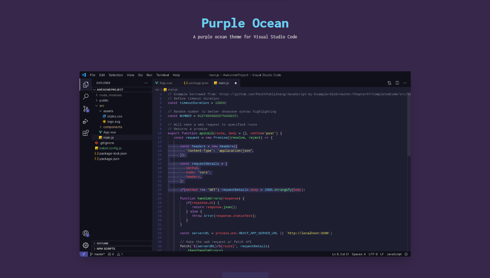

# Purple Ocean Theme Landing Page

A landing page to showcase the Purple Ocean Theme. I really didn't like any themes in the vscode marketplace so i decided to create my own theme.Hope you like this theme like me ;).

- <a href="https://purpleocean.netlify.app/">Ocean Purple Site</a>

